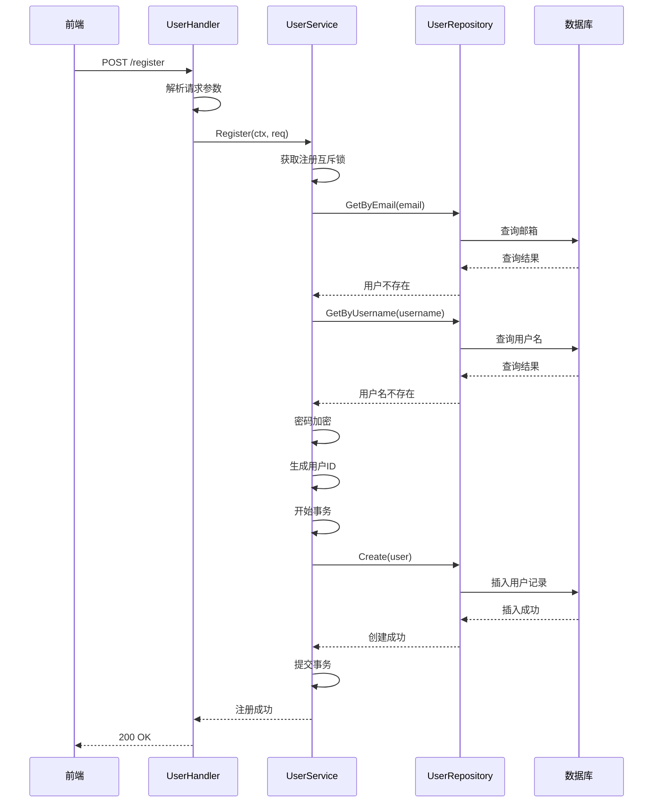
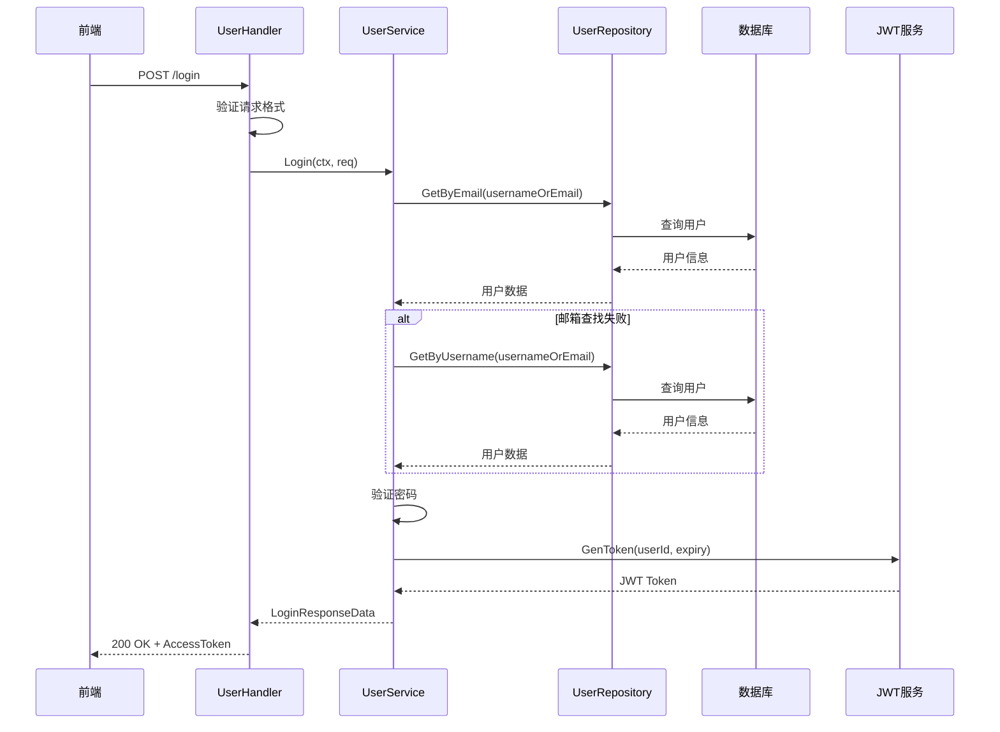
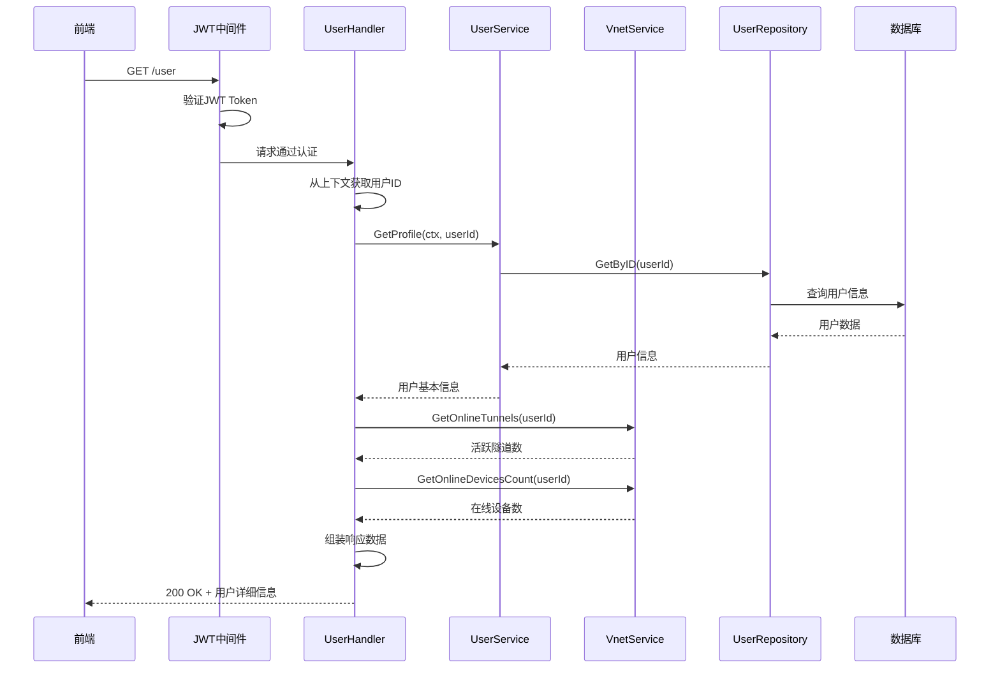
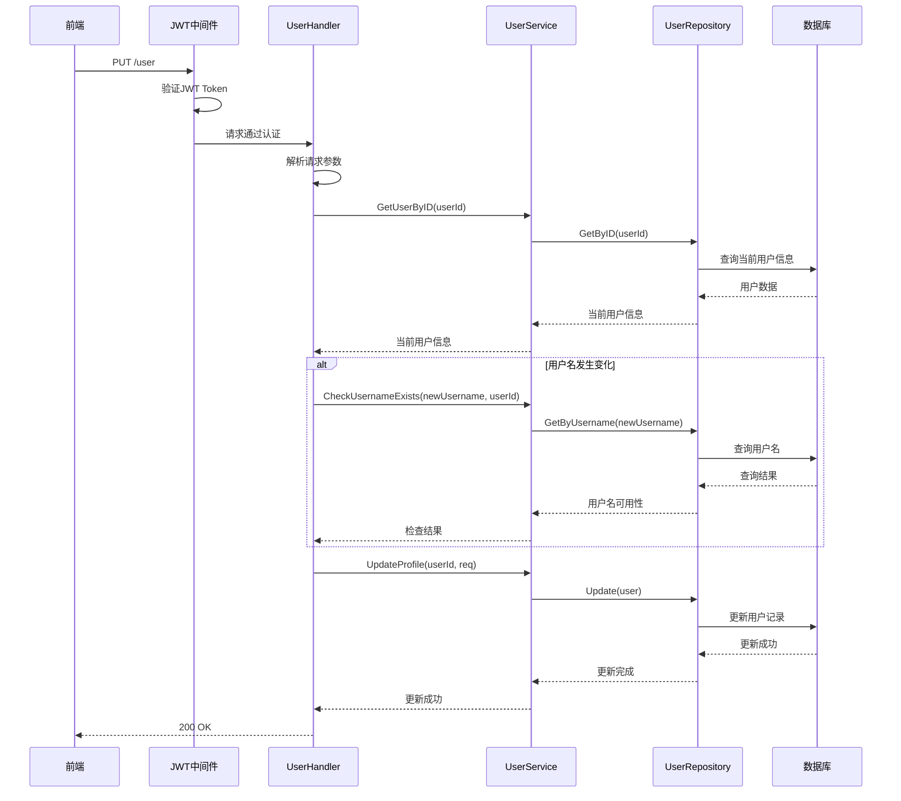
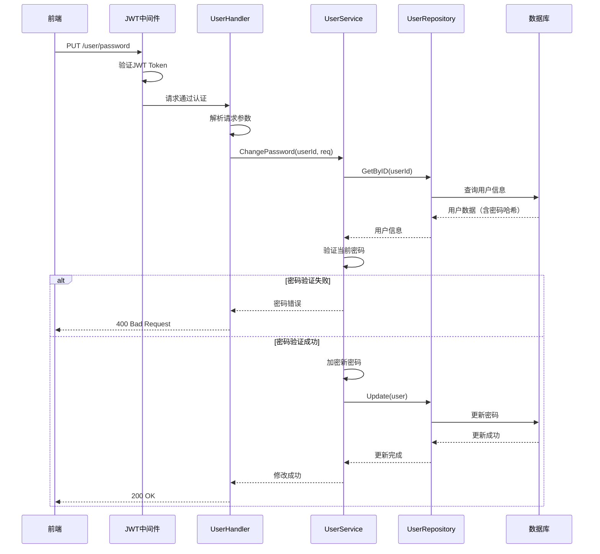
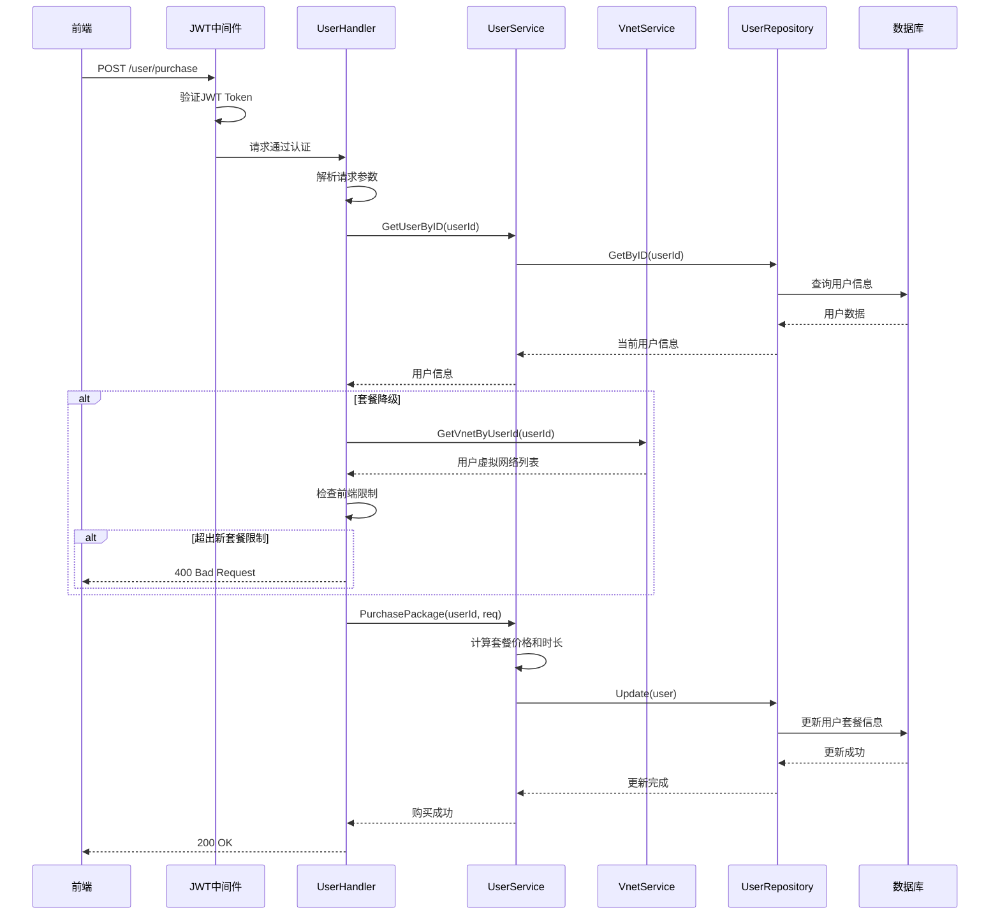
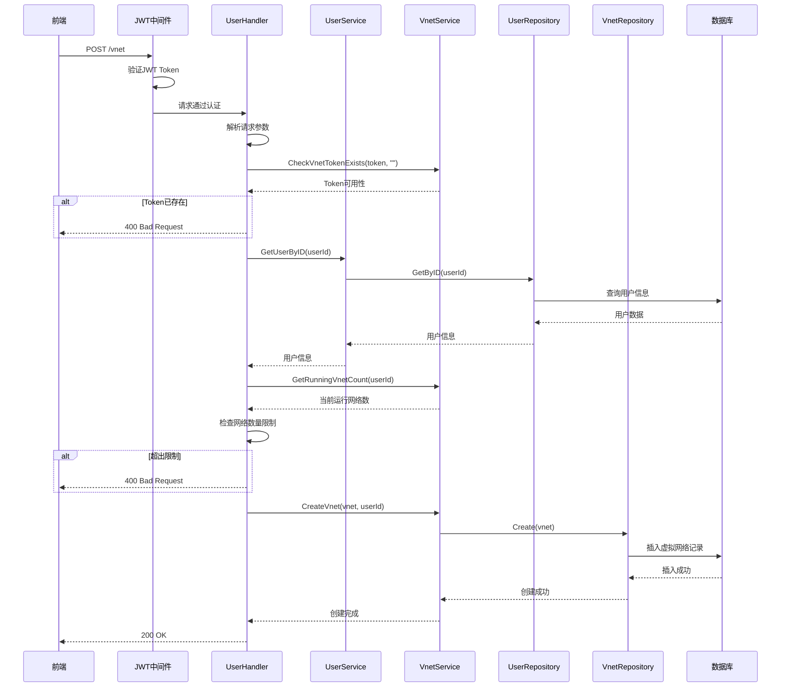
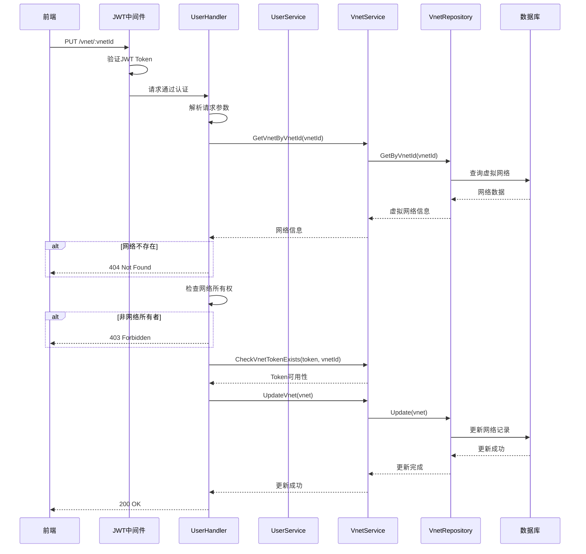
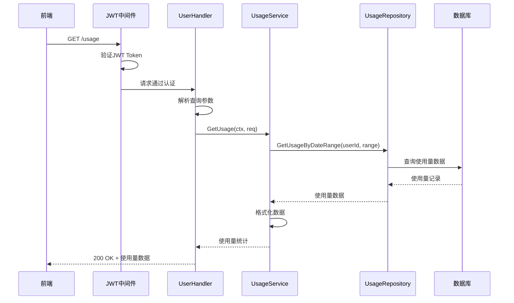
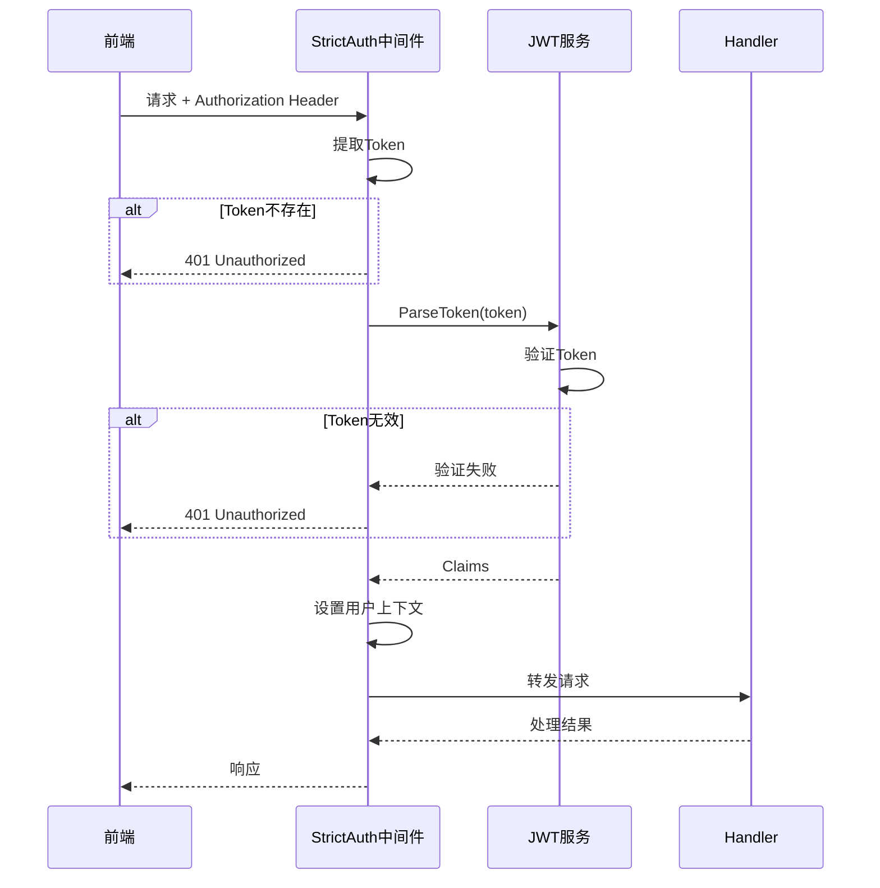

# 项目模型

## 用户注册

```mermaid
sequenceDiagram
    participant C as 前端
    participant H as UserHandler
    participant S as UserService
    participant R as UserRepository
    participant DB as 数据库

    C->>H: POST /register
    H->>H: 解析请求参数
    H->>S: Register(ctx, req)
    S->>S: 获取注册互斥锁
    S->>R: GetByEmail(email)
    R->>DB: 查询邮箱
    DB-->>R: 查询结果
    R-->>S: 用户不存在
    S->>R: GetByUsername(username)
    R->>DB: 查询用户名
    DB-->>R: 查询结果
    R-->>S: 用户名不存在
    S->>S: 密码加密
    S->>S: 生成用户ID
    S->>S: 开始事务
    S->>R: Create(user)
    R->>DB: 插入用户记录
    DB-->>R: 插入成功
    R-->>S: 创建成功
    S->>S: 提交事务
    S-->>H: 注册成功
    H-->>C: 200 OK
```
## 用户登录

```mermaid
sequenceDiagram
    participant C as 前端
    participant H as UserHandler
    participant S as UserService
    participant R as UserRepository
    participant DB as 数据库
    participant JWT as JWT服务

    C->>H: POST /login
    H->>H: 验证请求格式
    H->>S: Login(ctx, req)
    S->>R: GetByEmail(usernameOrEmail)
    R->>DB: 查询用户
    DB-->>R: 用户信息
    R-->>S: 用户数据
    alt 邮箱查找失败
        S->>R: GetByUsername(usernameOrEmail)
        R->>DB: 查询用户
        DB-->>R: 用户信息
        R-->>S: 用户数据
    end
    S->>S: 验证密码
    S->>JWT: GenToken(userId, expiry)
    JWT-->>S: JWT Token
    S-->>H: LoginResponseData
    H-->>C: 200 OK + AccessToken
```
## 获取用户信息

```mermaid
sequenceDiagram
    participant C as 前端
    participant M as JWT中间件
    participant H as UserHandler
    participant S as UserService
    participant VS as VnetService
    participant R as UserRepository
    participant DB as 数据库

    C->>M: GET /user
    M->>M: 验证JWT Token
    M->>H: 请求通过认证
    H->>H: 从上下文获取用户ID
    H->>S: GetProfile(ctx, userId)
    S->>R: GetByID(userId)
    R->>DB: 查询用户信息
    DB-->>R: 用户数据
    R-->>S: 用户信息
    S-->>H: 用户基本信息
    H->>VS: GetOnlineTunnels(userId)
    VS-->>H: 活跃隧道数
    H->>VS: GetOnlineDevicesCount(userId)
    VS-->>H: 在线设备数
    H->>H: 组装响应数据
    H-->>C: 200 OK + 用户详细信息
```
## 更新用户信息

```mermaid
sequenceDiagram
    participant C as 前端
    participant M as JWT中间件
    participant H as UserHandler
    participant S as UserService
    participant R as UserRepository
    participant DB as 数据库

    C->>M: PUT /user
    M->>M: 验证JWT Token
    M->>H: 请求通过认证
    H->>H: 解析请求参数
    H->>S: GetUserByID(userId)
    S->>R: GetByID(userId)
    R->>DB: 查询当前用户信息
    DB-->>R: 用户数据
    R-->>S: 当前用户信息
    S-->>H: 当前用户信息
    alt 用户名发生变化
        H->>S: CheckUsernameExists(newUsername, userId)
        S->>R: GetByUsername(newUsername)
        R->>DB: 查询用户名
        DB-->>R: 查询结果
        R-->>S: 用户名可用性
        S-->>H: 检查结果
    end
    H->>S: UpdateProfile(userId, req)
    S->>R: Update(user)
    R->>DB: 更新用户记录
    DB-->>R: 更新成功
    R-->>S: 更新完成
    S-->>H: 更新成功
    H-->>C: 200 OK
```
## 修改密码

```mermaid
sequenceDiagram
    participant C as 前端
    participant M as JWT中间件
    participant H as UserHandler
    participant S as UserService
    participant R as UserRepository
    participant DB as 数据库

    C->>M: PUT /user/password
    M->>M: 验证JWT Token
    M->>H: 请求通过认证
    H->>H: 解析请求参数
    H->>S: ChangePassword(userId, req)
    S->>R: GetByID(userId)
    R->>DB: 查询用户信息
    DB-->>R: 用户数据（含密码哈希）
    R-->>S: 用户信息
    S->>S: 验证当前密码
    alt 密码验证失败
        S-->>H: 密码错误
        H-->>C: 400 Bad Request
    else 密码验证成功
        S->>S: 加密新密码
        S->>R: Update(user)
        R->>DB: 更新密码
        DB-->>R: 更新成功
        R-->>S: 更新完成
        S-->>H: 修改成功
        H-->>C: 200 OK
    end
```
## 购买套餐

```mermaid
sequenceDiagram
    participant C as 前端
    participant M as JWT中间件
    participant H as UserHandler
    participant S as UserService
    participant VS as VnetService
    participant R as UserRepository
    participant DB as 数据库

    C->>M: POST /user/purchase
    M->>M: 验证JWT Token
    M->>H: 请求通过认证
    H->>H: 解析请求参数
    H->>S: GetUserByID(userId)
    S->>R: GetByID(userId)
    R->>DB: 查询用户信息
    DB-->>R: 用户数据
    R-->>S: 当前用户信息
    S-->>H: 用户信息
    alt 套餐降级
        H->>VS: GetVnetByUserId(userId)
        VS-->>H: 用户虚拟网络列表
        H->>H: 检查前端限制
        alt 超出新套餐限制
            H-->>C: 400 Bad Request
        end
    end
    H->>S: PurchasePackage(userId, req)
    S->>S: 计算套餐价格和时长
    S->>R: Update(user)
    R->>DB: 更新用户套餐信息
    DB-->>R: 更新成功
    R-->>S: 更新完成
    S-->>H: 购买成功
    H-->>C: 200 OK
```
## 创建虚拟网络

```mermaid
sequenceDiagram
    participant C as 前端
    participant M as JWT中间件
    participant H as UserHandler
    participant S as UserService
    participant VS as VnetService
    participant R as UserRepository
    participant VR as VnetRepository
    participant DB as 数据库

    C->>M: POST /vnet
    M->>M: 验证JWT Token
    M->>H: 请求通过认证
    H->>H: 解析请求参数
    H->>VS: CheckVnetTokenExists(token, "")
    VS-->>H: Token可用性
    alt Token已存在
        H-->>C: 400 Bad Request
    end
    H->>S: GetUserByID(userId)
    S->>R: GetByID(userId)
    R->>DB: 查询用户信息
    DB-->>R: 用户数据
    R-->>S: 用户信息
    S-->>H: 用户信息
    H->>VS: GetRunningVnetCount(userId)
    VS-->>H: 当前运行网络数
    H->>H: 检查网络数量限制
    alt 超出限制
        H-->>C: 400 Bad Request
    end
    H->>VS: CreateVnet(vnet, userId)
    VS->>VR: Create(vnet)
    VR->>DB: 插入虚拟网络记录
    DB-->>VR: 插入成功
    VR-->>VS: 创建成功
    VS-->>H: 创建完成
    H-->>C: 200 OK
```
## 编辑虚拟网络

```mermaid
sequenceDiagram
    participant C as 前端
    participant M as JWT中间件
    participant H as UserHandler
    participant S as UserService
    participant VS as VnetService
    participant VR as VnetRepository
    participant DB as 数据库

    C->>M: PUT /vnet/:vnetId
    M->>M: 验证JWT Token
    M->>H: 请求通过认证
    H->>H: 解析请求参数
    H->>VS: GetVnetByVnetId(vnetId)
    VS->>VR: GetByVnetId(vnetId)
    VR->>DB: 查询虚拟网络
    DB-->>VR: 网络数据
    VR-->>VS: 虚拟网络信息
    VS-->>H: 网络信息
    alt 网络不存在
        H-->>C: 404 Not Found
    end
	H->>H: 检查网络所有权
	alt 非网络所有者
		H-->>C: 403 Forbidden
	end
    H->>VS: CheckVnetTokenExists(token, vnetId)
    VS-->>H: Token可用性
    H->>VS: UpdateVnet(vnet)
    VS->>VR: Update(vnet)
    VR->>DB: 更新网络记录
    DB-->>VR: 更新成功
    VR-->>VS: 更新完成
    VS-->>H: 更新成功
    H-->>C: 200 OK
```
## 获取用量

```mermaid
sequenceDiagram
    participant C as 前端
    participant M as JWT中间件
    participant H as UserHandler
    participant US as UsageService
    participant UR as UsageRepository
    participant DB as 数据库

    C->>M: GET /usage
    M->>M: 验证JWT Token
    M->>H: 请求通过认证
    H->>H: 解析查询参数
    H->>US: GetUsage(ctx, req)
    US->>UR: GetUsageByDateRange(userId, range)
    UR->>DB: 查询使用量数据
    DB-->>UR: 使用量记录
    UR-->>US: 使用量数据
    US->>US: 格式化数据
    US-->>H: 使用量统计
    H-->>C: 200 OK + 使用量数据
```
## JWT 中间件

```mermaid
sequenceDiagram
    participant C as 前端
    participant SM as StrictAuth中间件
    participant JWT as JWT服务
    participant H as Handler

    C->>SM: 请求 + Authorization Header
    SM->>SM: 提取Token
    alt Token不存在
        SM-->>C: 401 Unauthorized
	end
	SM->>JWT: ParseToken(token)
	JWT->>JWT: 验证Token
	alt Token无效
		JWT-->>SM: 验证失败
		SM-->>C: 401 Unauthorized
	end
	JWT-->>SM: Claims
	SM->>SM: 设置用户上下文
	SM->>H: 转发请求
	H-->>SM: 处理结果
	SM-->>C: 响应
```
