# 快速开始

## 注册与登录

- 访问 [Hyacinth 官网](https://hyacinth.baka9.vip/)
- 注册账号并登录
  
  

## 新建虚拟网络
(该部分演示以白银套餐为例)
- 点击“新建虚拟网络”

  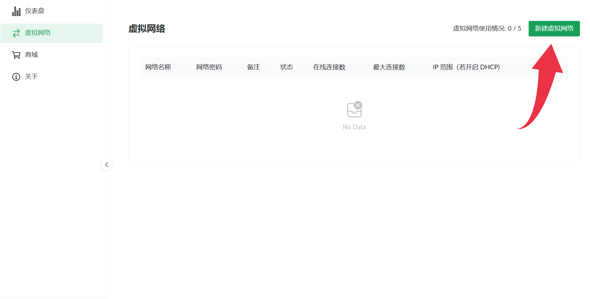

- 可选择随机生成或自行输入唯一且不与他人重复的网络名称，并设置网络密码

  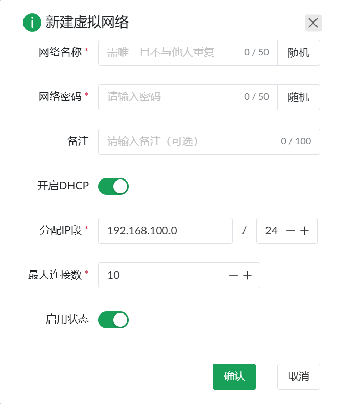

- 点击“确认”后，成功新建虚拟网络

  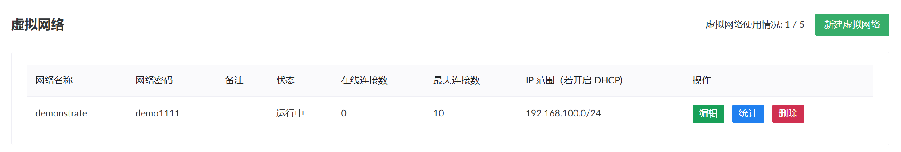

- 用户可以点击 `编辑` 修改虚拟网络的网络名称、网络密码、是否开启DHCP和最大连接数等。
  
  **注意**：最大连接数不可以超过购买套餐的最大同时在线数！

  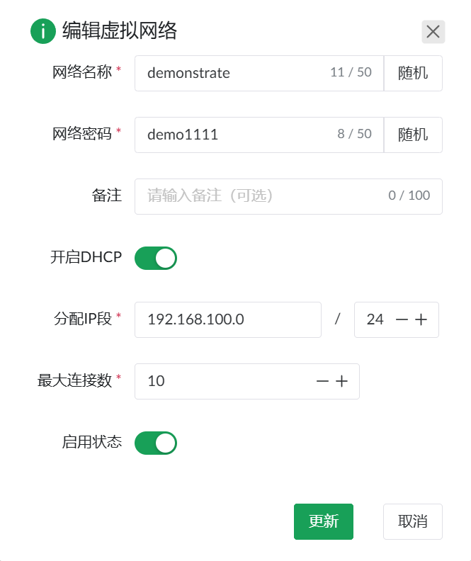

- 用户点击 `删除` 将直接删除建立的虚拟网络 


## 下载客户端并连接网络

- 下载兼容 EasyTier 协议的客户端，推荐下载官方提供的 [EasyTier GUI 客户端](https://github.com/EasyTier/EasyTier/releases/tag/v2.2.4)
  
  请选择符合自身电脑型号匹配的版本下载，如果你是 Windows 用户，请下载 `easytier-gui-2.2.4-x64-setup.zip`：
  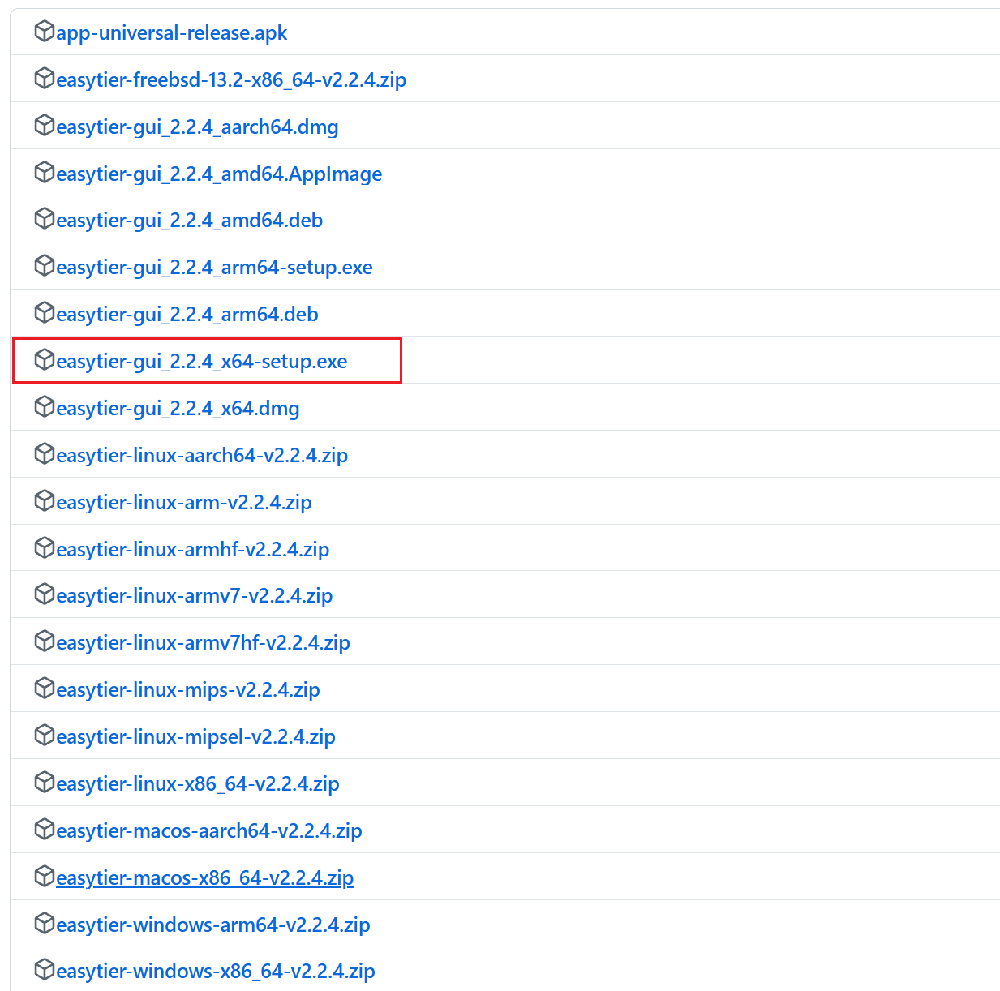

  EasyTier GUI 在 Windows 平台依赖较高版本的 WebView 组件，建议使用 Windows 10 或更高版本的操作系统。

  项目基于 EasyTier 2.2.4 版本，EasyTier 近段时间推出了 2.3.0 Release，可能会有一些不兼容的改动，尚未进行测试，请尽量使用 2.2.4 版本客户端进行测试。

- 打开客户端，手动配置网络：
  - 输入虚拟 IP 地址或者打开 DHCP，如果打开 DHCP，客户端会自动获取虚拟 IP 地址
  - 网络名称和网络密码，需要和新建虚拟网络时设置的保持一致
  - 手动设置网络方式： `tcp://baka9.vip:60002` 或 `udp://baka9.vip:60002`，也可以同时使用二者

  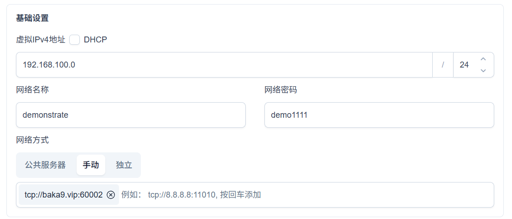

  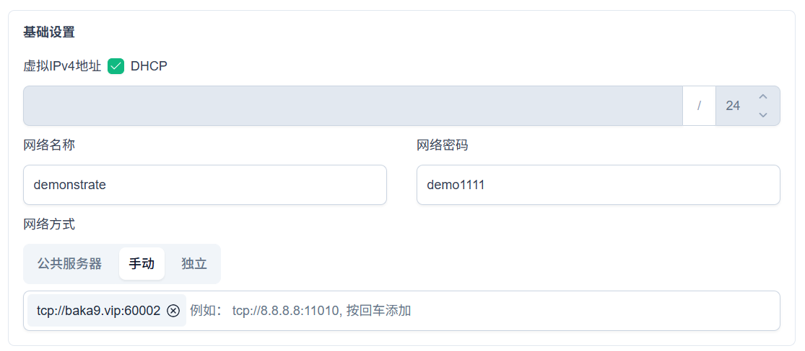

- 高级设置：
  - 还可以更改主机名
    
    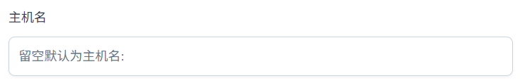

- 配置完成后点击“运行网络”。用户可以在客户端中查询到当前节点信息，如下图所示：

  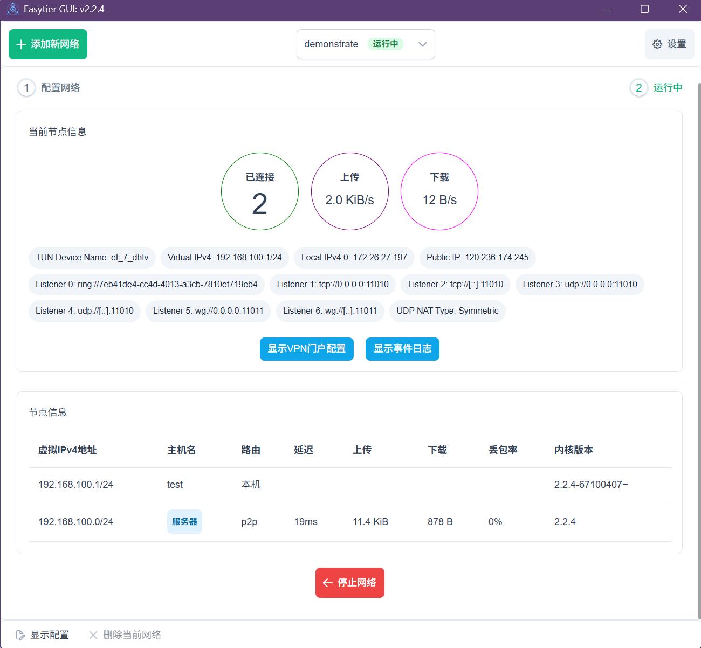

## 测试联通性

- 打开终端，使用 `ping` 命令测试与同一虚拟网络中其他设备的连接，例如：

```bash
ping 192.168.100.1
```

- 如果成功收到响应（如 `数据包: 已发送 = 4，已接收 = 4，丢失 = 0 (0% 丢失)` ），说明虚拟网络成功连接。

- 在用户面板的 `虚拟网络` 界面，可以点击对应虚拟网络右侧的 `流量` 按钮以查询对应的虚拟网络的流量统计。同时，也可以在 `仪表盘` 页面查询总流量统计。

  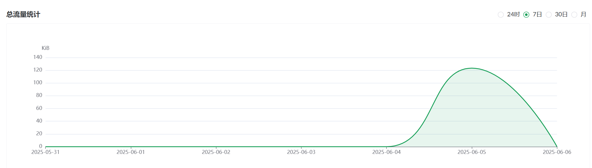

  **注意**：流量使用完后将无法连接虚拟网络！

## 购买增值服务
打开 `商城` 购买服务，目前提供了白银、黄金和钻石三种套餐，分别对应不同的最大同时在线数和流量限制。

项目处于测试期，点击购买不会真正扣费，可以尝试不同的套餐。

  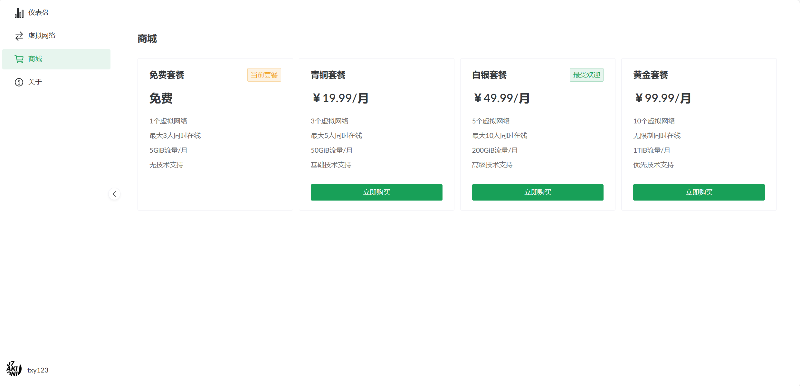

  **注意**：购买更高级的套餐将会覆盖原有的套餐
  
  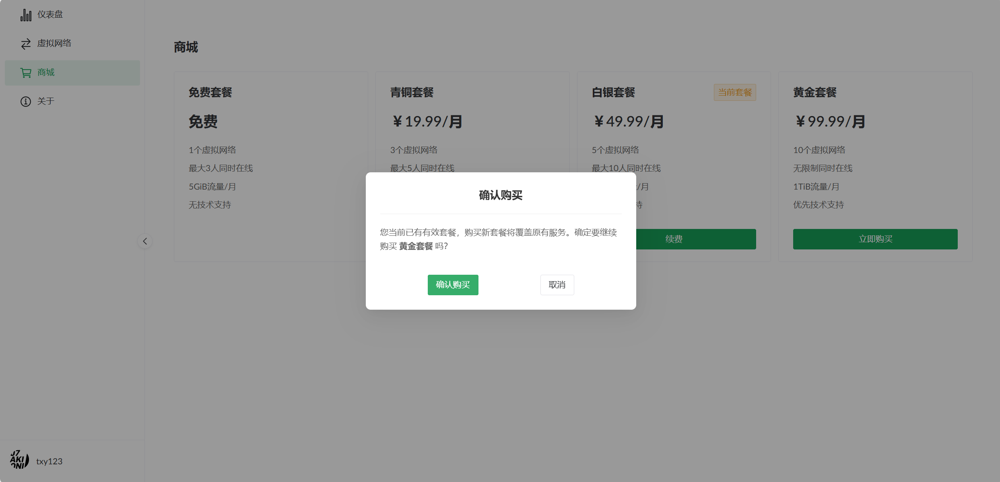

## 常见问题

### 可以连接虚拟网络，但无法 ping 通其他设备
- 确保所有用户**同时开启**或**同时关闭** `禁用加密` 功能开关。
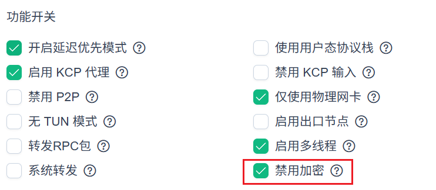

- 如果上述方法不可用，还可以尝试关闭防火墙，并重新尝试连接。

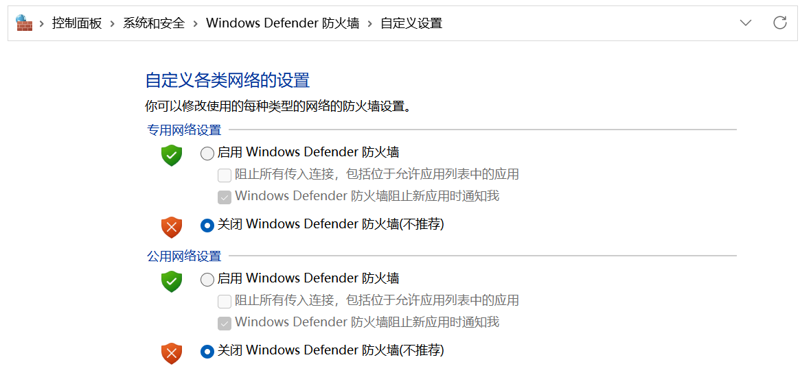