# 软件需求规格说明书

## 1. 引言
### 1.1 编写目的
本文档旨在明确阐述“Hyacinth”软件项目的各项需求。

Hyacinth 是一个基于 EasyTier、Go 和 Vue 构建的虚拟组网平台，旨在为跨校园网络通信、远程开发、虚拟局域网游戏联机等场景提供轻量、高效的商业化组网解决方案。

### 1.2 编写背景
在数字化时代，个人与组织对网络连接的灵活性、安全性与易用性提出了前所未有的高要求。用户常常面临跨越不同物理地点、复杂网络环境进行数据共享、协同工作等需求。

我们的团队分析了已有的付费组网软件，但它们都存在以下问题中的至少一个：

* 只协助进行 P2P 连接，在多层 NAT 环境下无法使用
* 服务器延迟过大，几乎不可用

免费的开源软件存在以下问题：

* 需要自建服务器，普通用户使用不方便

因此，开发一款能够简化虚拟组网过程、提供稳定高效连接的商业化组网解决方案，具有广泛的市场需求和应用价值。Hyacinth 项目的推出，正是为了应对这些挑战，其目标是提供更加普适、便捷且强大的虚拟网络服务。

### 1.3 名词定义
*   Hyacinth: 本项目的名称，一个基于 EasyTier、Go 和 Vue 构建的虚拟组网平台。
*   EasyTier : 一款开源的点对点 VPN 软件，用于创建虚拟以太网。本项目基于其核心进行修改和扩展。

## 2. 软件产品的一般性描述

### 2.1 功能概述
Hyacinth 作为一个商业化的虚拟组网解决方案，为用户提供了一系列便捷而强大的网络功能。其核心功能包括：

- 虚拟网络创建：用户可以自主创建虚拟网络，设置虚拟网络的名称与密码。
- 虚拟网络连接：接入同一虚拟网络的用户设备，将能够在局域网中进行通信和资源共享。

### 2.2 用户特点
Hyacinth 的目标用户因其具体应用场景而展现出不同的需求和行为特征：

1.  远程协作开发者:
    *   示例: 软件工程师、IT技术人员、或参与分布式项目的学生。
    *   核心场景: 在Hyacinth构建的虚拟网络中进行代码协作、访问远程服务器/数据库、进行联合调试或共享开发环境。
    *   关注点: 追求低延迟、稳定可靠的网络连接以保证开发效率；重视数据传输的安全性；可能需要管理多个项目或团队的虚拟网络。
2.  虚拟局域网游戏玩家:
    *   示例: 喜爱与朋友联机游戏的玩家，特别是依赖局域网联机模式连接的游戏爱好者。
    *   核心场景: 通过 Hyacinth 创建、加入虚拟局域网，与不同物理位置的朋友实现多人游戏联机，享受如同在同一局域网下的游戏体验。
    *   关注点: 极低的延迟和高稳定性是首要需求，以避免游戏卡顿或掉线；操作简单，能够快速组队开黑。
3.  文件共享与协同办公用户:
    *   示例: 需要在不同设备或与他人安全共享文件的个人用户、小型团队成员、或需要临时搭建共享网络环境的用户。
    *   核心场景: 利用Hyacinth虚拟网络安全地传输文件、共享文件夹、访问NAS等私有存储，或进行小范围的内部资料共享和协同编辑。
    *   关注点: 文件传输的便捷性和安全性；易于管理接入设备的权限；连接稳定，确保大文件传输不中断。

这些用户群体虽然应用场景各异，但共同期望 Hyacinth 能提供一个易于使用、稳定高效的虚拟网络解决方案，以克服地理位置和复杂网络环境带来的连接障碍。

## 3. 功能需求

本章节旨在阐述 Hyacinth 平台的功能需求。为了更直观地描述这些功能，本章节主要采用用例图和序列图进行辅助说明。

需要强调的是，当前文档处于需求分析阶段。因此：

* 所呈现的用例图和序列图详细程度较为粗略，它们只是为了初步明确需求而绘制的。
* 项目最终的设计与实现，可能会与这些用例图、序列图存在差异。

### 3.1 用户账户管理

#### 3.1.1 用户注册

系统必须允许新用户通过提供必要的身份验证信息（如：用户名、密码、电子邮箱地址等）来创建个人 Hyacinth 账户。系统需确保用户名的唯一性，并对用户设定的密码强度进行基础校验。

用例图如下：

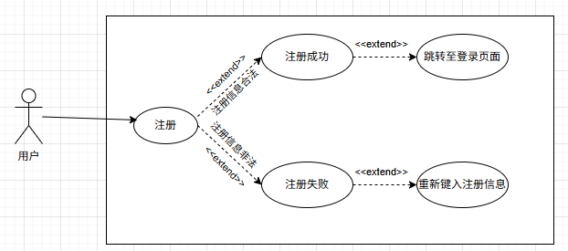

序列图如下：

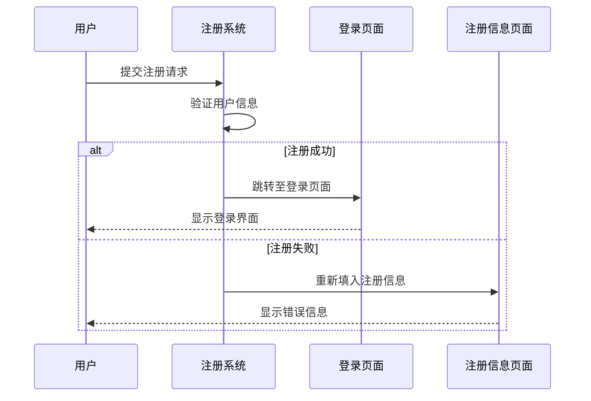

#### 3.1.2 用户登录

系统必须为已注册用户提供安全的登录途径，用户可通过输入正确的账户凭证（如：用户名或电子邮箱及密码）访问其账户。系统需有效处理登录失败的情况，并给出适当提示。

用例图如下：

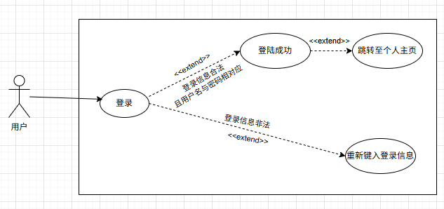

序列图如下：

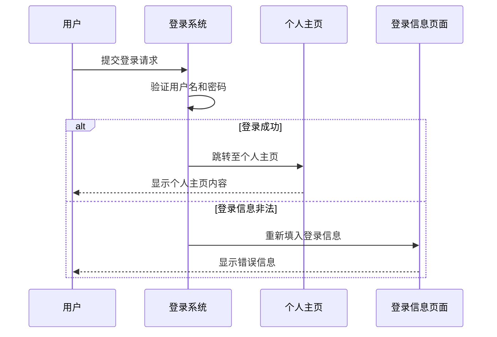

### 3.2 虚拟网络管理

在虚拟网络管理模块，用户可以对多个虚拟网络进行增删改查操作：

*   创建虚拟网络：已登录用户必须能够创建新的虚拟网络。在创建过程中，用户需能自定义网络的关键属性，如网络名称、网络接入密码（用于客户端连接时验证）、以及允许的最大连接设备数等。

*   编辑虚拟网络：用户必须能够修改其拥有权限的虚拟网络的基本配置信息，例如更改网络名称、重置网络接入密码等。

*   删除虚拟网络：用户必须能够删除其创建的虚拟网络。为防止误操作，删除前系统应有明确的确认提示。网络一旦删除，其所有配置信息将被清除，已连接该网络的客户端将断开连接。

*   查看流量及用量：用户必须能够方便地查询其账户下与所购服务相关的各项用量信息，例如已使用的网络流量、当前连接设备数、服务有效期等。系统需保证用量数据的准确性和及时性。

用例图如下：

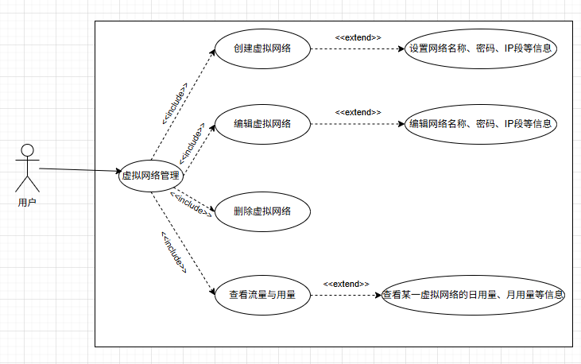

创建虚拟网络的序列图如下：

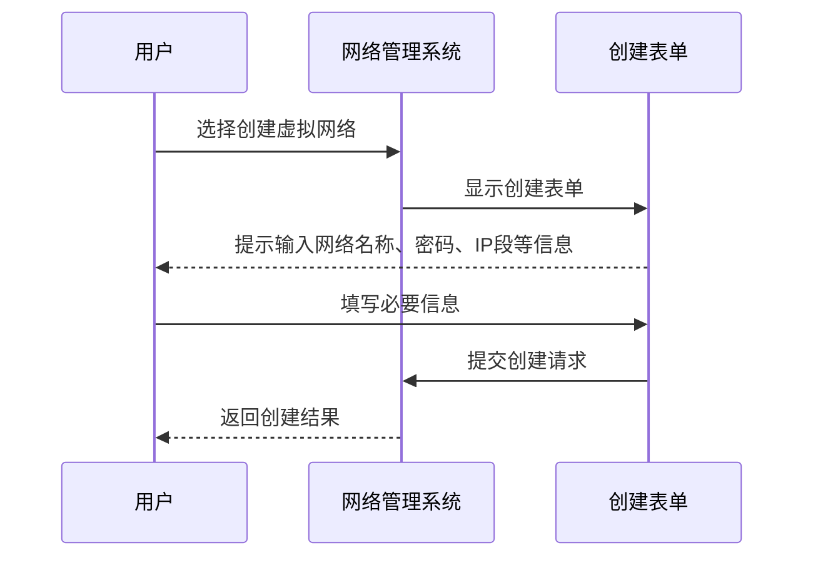

编辑虚拟网络的序列图如下：

删除虚拟网络的序列图如下：

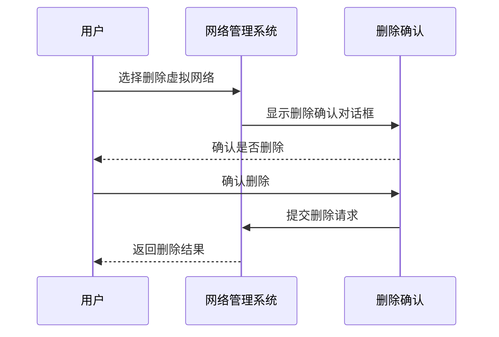

查看流量与用量的序列图如下：

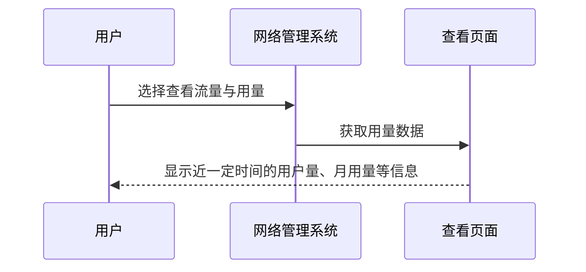

### 3.3 网络连接与访问控制

用户通过客户端请求连接网络。Hyacinth 平台在接收到来自客户端的网络连接请求后，验证用户的接入权限。若验证通过，则用户成功接入虚拟网络。

用例图如下：

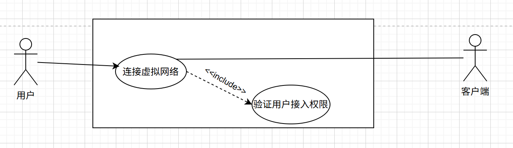

序列图如下：

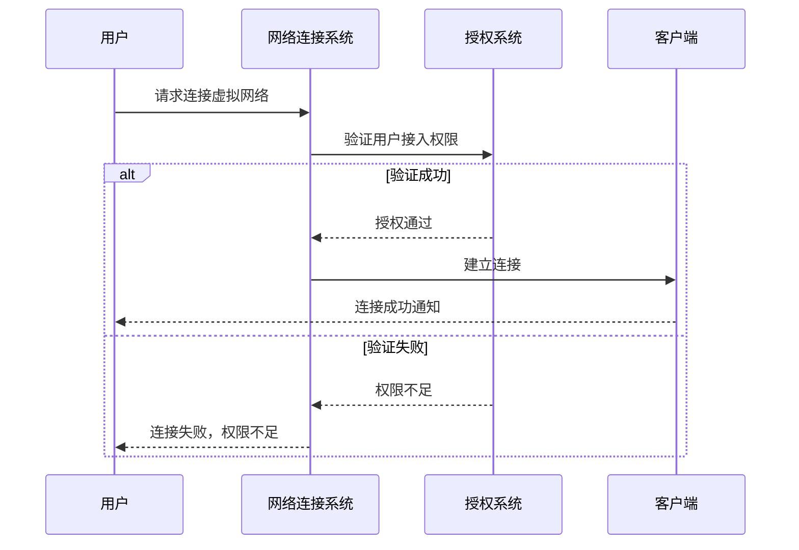

### 3.4 服务订阅与管理

Hyacinth 平台将采取会员制，为不同用户提供个性化服务。用户可以通过平台订购和管理服务：

*   服务升级：对于用户，系统必须支持用户将其当前的服务套餐升级到功能更强或资源更多的套餐级别。系统需能处理由此产生的服务配置变更，譬如新的套餐会自动覆盖原有的套餐。
*   服务降级：对于已购买服务的用户，系统必须允许用户将其当前的服务套餐降级到较低的套餐级别。系统需能处理由此产生的服务配置变更。

用例图如下：

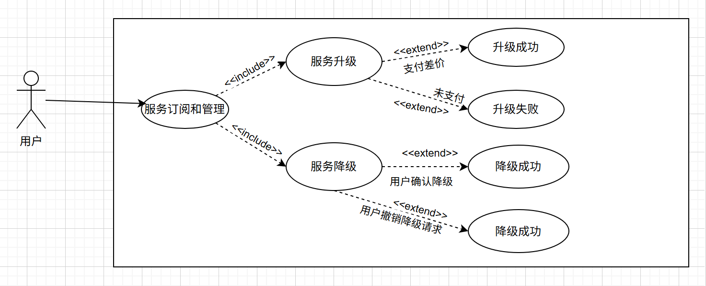

升级服务的序列图如下：

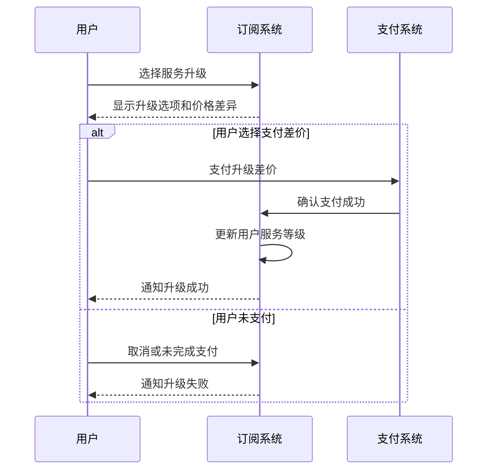

降级服务的序列图如下：

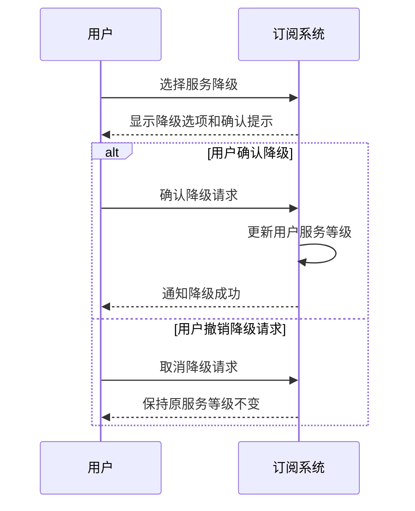

## 4. 非功能需求及其他需求

本章节主要阐述系统在功能需求之外应满足的其他相关的必要条件。

### 4.1 易用性
用户界面（包括网页端和客户端）应设计友好，操作流程应简洁明了，有效降低用户的学习成本和使用门槛。

### 4.2 可靠性
系统应具备高可用性，确保服务在绝大多数时间内的稳定运行。虚拟网络连接应具备良好的持续性和较低的断线率。

### 4.3 安全性
1. 用户账户信息、密码应得到充分的安全保障。

2. 网络配置数据、通过虚拟网络传输的数据应得到充分的安全保障。

### 4.4 性能
虚拟网络的连接建立速度应较快。数据传输延迟应尽可能低，以满足实时应用（如游戏、远程桌面）的需求。系统应能承载预期的并发用户数和网络流量。

### 4.5 兼容性
客户端软件应支持主流操作系统，如Windows、Linux和Android等。

系统设计应能兼容原版 EasyTier 客户端的连接。

### 4.6 可维护性
系统架构设计应清晰、模块化，易于维护，易于后续的功能升级迭代。

### 4.7 数据管理需求
系统涉及的主要数据及其管理要求如下：

*   用户账户数据：包括用户名、密码、电子邮箱、服务订阅状态等。需确保数据的一致性和安全性。
*   虚拟网络数据：包括网络名称、网络密码、最大连接数等。
*   用户用量数据：精确记录各用户的流量使用情况、连接时长等与计费相关的数据。

系统应具有完善的数据管理功能，以确保数据的安全性和完整性。

### 4.8 合规性
产品设计、开发和运营需严格遵守国家及地区关于数据保护、网络安全、个人信息保护等相关法律法规的要求。

### 4.9 文档化
需提供以下相关文档：

*   用户使用手册：用于指导用户完成注册、登录、网络创建与连接、服务购买等操作。
*   项目架构文档：用于展示项目架构，为项目参与者理解项目提供便利。
*   必要的 API 接口文档：供开发者使用，帮助他们理解和使用 Hyacinth 后端提供的功能接口。

## 5.市场需求

本章节旨在通过用户需求调查问卷的数据，分析Hyacinth的市场需求和潜在用户痛点，以指导产品的开发和优化。

### 5.1 问卷调查背景

为了深入了解用户对组网工具的需求、痛点及期望，我们设计并发布了一份名为“组网工具使用需求调查问卷”的在线问卷 ，问卷共收集到61份有效填写人次 。

### 5.2 用户组网需求分析

#### 5.2.1 主要组网需求场景

根据调查结果，用户的主要组网需求场景集中在：

* 远程办公访问公司/学校内网：67.21% 的受访者有此需求 

* 跨地区游戏联机：65.57% 的受访者有此需求 

这表明Hyacinth在解决远程办公和跨区域游戏联机方面具有广阔的市场前景。

#### 5.2.2 用户痛点

在组网过程中，用户普遍遇到了以下问题：

* 游戏联机问题：

  - 70% 的玩家遇到联机卡顿、延迟高的问题 

  - 40% 的玩家遇到无法与外地朋友联机的问题 

  - 37.5% 的玩家觉得找不到服务器或输入IP地址太麻烦 

* 远程办公/学习问题：

  - 53.66% 的用户遇到在家连接公司电脑困难或文件传输慢的问题 

  - 26.83% 的用户认为操作步骤复杂，需要IT协助设置 

这些痛点进一步验证了市场对一款轻量、高效、易用的虚拟组网解决方案的迫切需求。

#### 5.2.3 期望功能

用户对组网工具的期望功能与Hyacinth的核心功能高度契合：

* 操作简单便捷：
  * 75.41% 的用户希望操作简单，不用输复杂的IP地址 

* 高效稳定的连接：

  - 72.13% 的用户希望在家能像在办公室一样秒连公司电脑 

  - 67.21% 的用户希望联机游戏不卡顿，点一下就能和朋友连上 

* 文件传输速度：
  * 73.77% 的用户希望手机/电脑/电视传文件超快，不用数据线 

此外，32.79% 的用户还希望工具能保护隐私、同时连接更多设备 ，这也与Hyacinth在安全性和多设备连接方面的设计目标一致。

### 5.3 现有组网工具使用情况与偏好

* **当前使用情况：**

  - 60.66% 的用户使用游戏平台内置联机功能 

  - 27.87% 的用户使用商业服务（如蒲公英、ZeroTier） 

  - 21.31% 的用户使用开源工具（如Frp、TailScale） 
  - 29.51% 的用户没有使用过组网工具 

这表明Hyacinth面临的市场竞争主要来自于游戏平台内置功能和现有商业服务，同时也有相当一部分潜在用户尚未接触过组网工具。

* **吸引用户的关键因素：**

  - 77.05% 的用户认为“完全免费，但基础功能满足需求”最吸引他们 

  - 72.13% 的用户认为“操作简单，无需技术背景”最吸引他们 

  - 31.15% 的用户对“付费版提供高速节点和更多设备连接”感兴趣 

  - 32.79% 的用户希望“支持与现有工具互通（如WireGuard）” 

这些数据表明，Hyacinth在产品设计上应优先考虑操作简便性和基础免费功能，同时提供有吸引力的付费增值服务。

### 5.4 服务模式与定价期望

* **免费版限制接受度：**

  - 57.38% 的用户能接受“单隧道同时连接设备数≤2台”的限制 

  - 27.87% 的用户能接受“每月流量上限5GB”的限制 

  - 32.79% 的用户能接受“无技术支持”的限制 

  - 22.95% 的用户表示完全不能接受限制 

* **付费心理价位：**

  - 52.46% 的用户能接受“每月≤10元（含基础流量和1个隧道）”的付费服务 

  - 47.54% 的用户倾向于“免费基础版+增值服务付费（如节点加速）”模式 

  - 34.43% 的用户能接受“每月11-20元（含高速节点和多设备连接）” 

这些数据为Hyacinth的服务订阅和定价策略提供了重要参考，建议采用“免费增值”模式，并提供不同价格区间的套餐以满足多样化需求。

### 5.5 市场接受度与使用意向

- 27.87% 的受访者表示“肯定会用（正好有需求，期待工具上线）”Hyacinth 
- 57.38% 的受访者表示“可能会用（看功能是否符合需求）”Hyacinth 

这表明Hyacinth具有较高的潜在市场接受度，但产品功能和用户体验将是影响其最终市场表现的关键因素。

