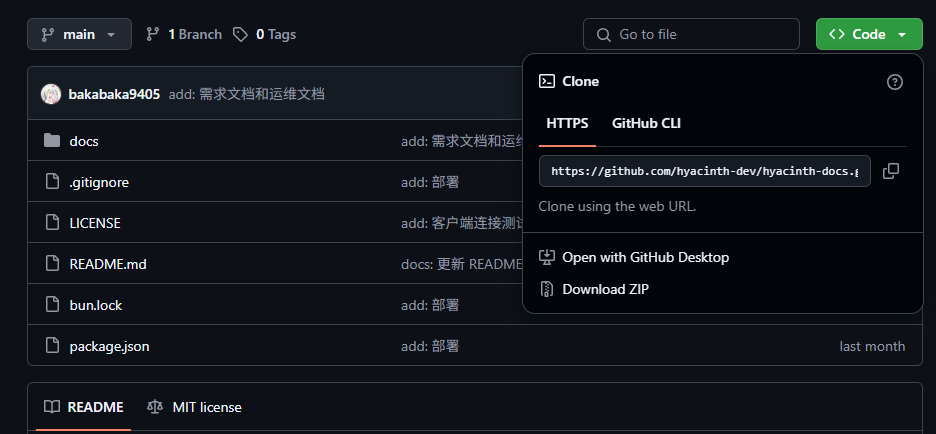
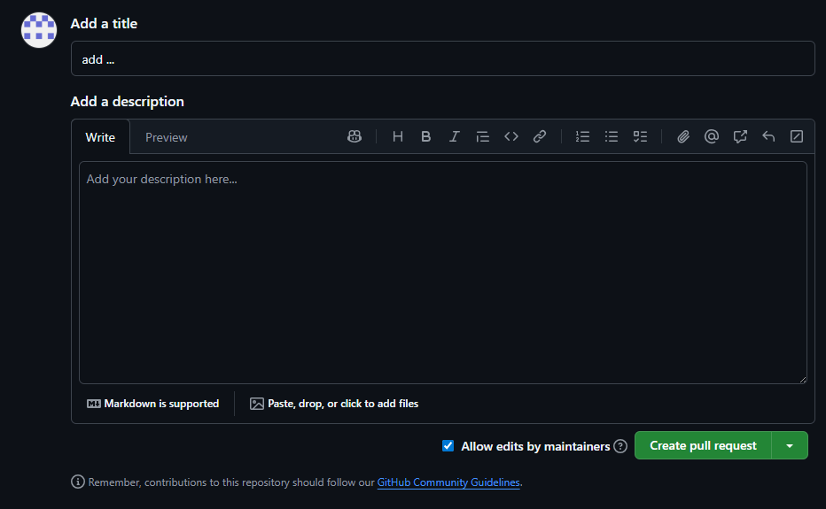
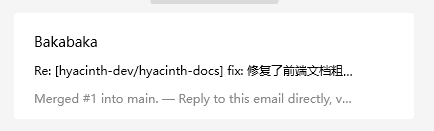

# <center>软件工程化说明文档</center>

## 1. 概述

本文档旨在规范 Hyacinth 项目的开发与协作流程。

Hyacinth 项目从代码编写到文档管理，均遵循软件工程化的思想与方法。为确保项目质量、提升团队协作效率，所有项目成员都严格遵守本说明文档中定义的协作规范。一个清晰、统一的工作流是高质量软件产品的基石。

## 2. 协作流程

我们采用基于 Git 和 GitHub 的标准化协作流程。该流程的核心是：**分支开发，拉取请求，代码审查，合并入主线**。这确保了主分支（`main`）的稳定性，并让所有代码变更都经过团队的共同检视。

下面的介绍以存放项目文档的仓库 `hyacinth-docs` 为例，对协作流程进行介绍。

### 2.1 准备工作：加入组织与克隆仓库

1.  加入 Organization：
    项目管理员会向你的 GitHub 账户发送组织邀请。请登录 GitHub，在邮件或页面右上角的通知中接受邀请。

2. 克隆项目仓库：
   进入 Hyacinth 项目在组织中的仓库页面，点击绿色的 `Code` 按钮，复制仓库的 URL。



然后打开你的本地终端，执行 `git clone` 命令将项目克隆到本地。
```bash
# 使用 HTTPS 协议克隆仓库
git clone https://github.com/hyacinth-dev/hyacinth-docs.git

# 进入项目目录
cd hyacinth-docs
```

### 2.2 开发流程：创建分支与提交代码

所有开发工作，包括新功能、Bug 修复等，都必须在新的分支（Branch）上进行，严禁直接向 `main` 主分支提交代码。

1.  创建并切换到新分支：
    首先，从最新的 `main` 分支创建并切换到你的新分支。分支名应清晰描述其用途，例如 `feature/user-login` 或 `fix/payment-bug`。

    ```bash
    # 1. 切换到 main 分支并拉取最新代码，确保你的起点是正确的
    git checkout main
    git pull origin main
    
    # 2. 创建一个新分支并切换过去
    git checkout -b feature/your-new-feature
    ```

2.  进行开发与提交（Commit）：
    在你的新分支上进行代码的编写和修改。当你完成一个有意义的改动单元后，就应该进行一次提交。

    ```bash
    # 将所有修改过的文件添加到暂存区
    git add .
    
    # 提交更改，并撰写清晰的提交信息 (Commit Message)
    git commit -m "fix: 修复了..."
    ```

3.  推送（Push）分支到远程仓库：
    当你准备好让团队成员看到你的代码（例如，一个阶段性功能完成），将你的分支推送到远程 GitHub 仓库。

    ```bash
    # 将你的新分支推送到名为 origin 的远程仓库
    git push origin feature/your-new-feature
    ```


### 2.3 合并流程：创建PR

当你的开发工作完成并推送到远程仓库后，你需要创建一个 PR，请求将你的分支合并到 `main` 分支。

1. 创建 PR：
   推送分支后，打开 Hyacinth 的 GitHub 仓库首页，通常会看到一个的提示条，让你方便地对刚才推送的分支创建 PR。

   

2. 填写 PR 信息：
   点击此按钮，进入 PR 创建页面。请认真填写标题和描述，清晰地说明本次改动的内容、目的以及如何测试。

   

### 2.4 代码审查与合并

PR 是团队协作的核心。

1.  代码审查（Code Review）：
    你指定的审查者会收到通知，并在线检查你的代码变更。他们会在需要修改或讨论的地方留下评论。你需要关注这些评论并进行相应的修改和回复。

2.  合并（Merge）：
    在所有讨论和修改完成后，当 PR 得到审查者批准，并且所有自动化检查都通过后，项目管理员会将其合并（Merge）到 `main` 分支。至此，你的代码就正式进入项目主线了。

在代码审查通过、分支合并成功之后，分支提交者的邮箱中会收到“分支合并成功”的信息：



## 3. 流程总结

整个协作流程的核心步骤总结如下。每一次向项目中贡献代码或文档，都应遵循这个闭环：

1. 同步与创建：在开始新任务前，务必先同步远程 main 分支的最新内容，然后基于此创建一个新分支。
2. 开发与提交：在自己的新分支上进行开发或修改，并以清晰的提交信息 (commit) 保存每一次有意义的改动。
3. 推送远程：完成阶段性工作后，将本地分支推送到 (push) 远程 GitHub 仓库，以便他人看到你的进度。
4. 发起请求：在 GitHub 上创建 PR，将你的分支指向 main 分支，并清晰填写 PR 的标题和描述。
5. 审查与修改：积极关注 PR 下的评论，与团队成员协作，根据反馈进行代码或文档的修改和完善。
6. 等待合并：一旦 PR 通过审查，项目管理员会将其合并入 main 分支，你的贡献便正式成为项目的一部分。

所有成员严格应遵守此工作流。这不仅是项目管理的要求，更是保障 main 分支时刻稳定、确保每一次变更都清晰可追溯的关键实践。