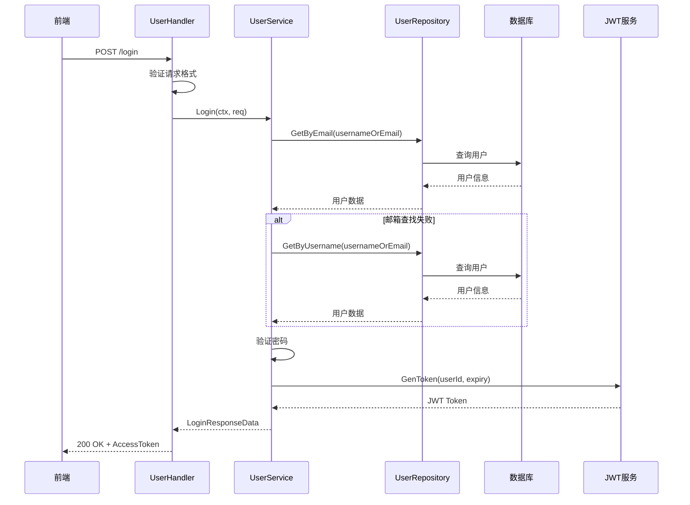
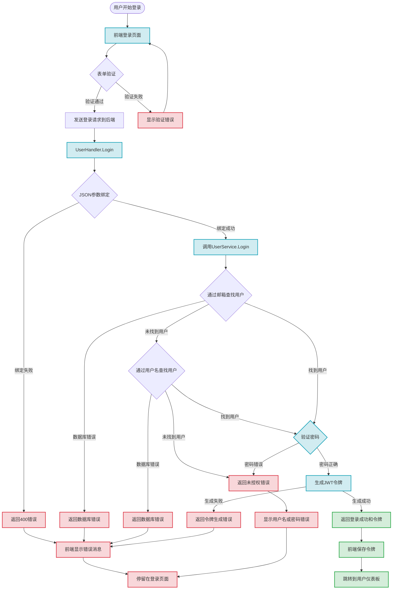
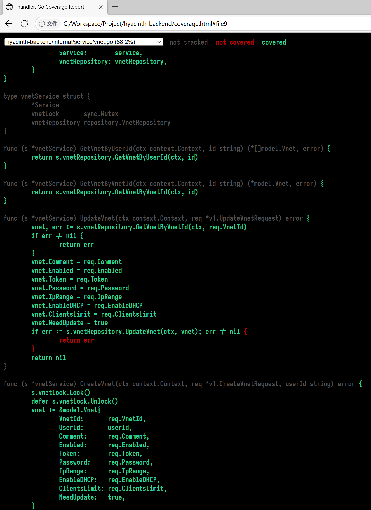
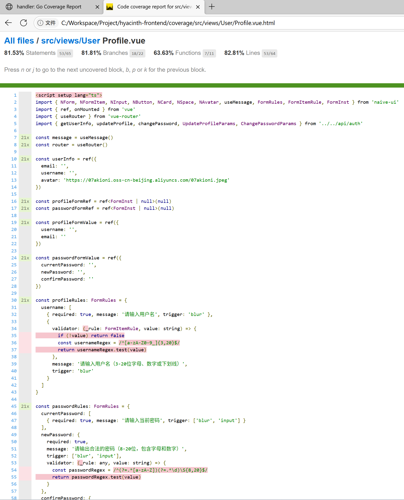

# 单元测试

本项目采用前后端分离的架构设计。前端使用 Vue 3 + TypeScript + Naive UI 的技术栈，后端基于 Go 语言和 Nunu 框架构建。

Vue 的组件化设计让每个功能模块都相对独立，可以针对单个组件编写单元测试而不用担心其他组件的干扰。Vue 3 的组合式 API 也让逻辑复用变得更加容易，可以将复杂的业务逻辑抽取成独立的 composables，然后针对这些逻辑编写专门的测试。

后端 Nunu 框架是一个采用分层架构设计的 Go Web 框架。Nunu的架构设计遵循 Clean Architecture 的思想，将应用程序分为多个层次：Handler 层负责处理 HTTP 请求和响应，Service 层实现具体的业务逻辑，Repository 层负责数据访问，Model 层定义数据结构：


```
├── api/                  # API 接口定义
│   └── v1/               # v1 版本 API
├── cmd/                  # 应用程序入口
│   ├── migration/        # 数据库迁移
│   ├── server/           # HTTP 服务器
│   └── task/             # 定时任务
├── config/               # 配置文件
├── docs/                 # Swagger 文档
├── internal/             # 内部代码
│   ├── handler/          # HTTP 处理器
│   ├── middleware/       # 中间件
│   ├── model/            # 数据模型
│   ├── repository/       # 数据访问层
│   └── service/          # 业务逻辑层
├── pkg/                  # 公共库
└── test/                 # 测试文件
```

这种分层架构对测试极其友好。每一层都有明确的职责边界，可以很容易地对每一层进行独立测试。如测试 Service 层时，可以通过 Mock Repository 层来隔离数据库依赖；测试 Handler 层时，可以 Mock Service 层来专注于 HTTP 协议相关的逻辑。Nunu 框架还集成了 Wire 依赖注入框架，在测试时可以很方便地替换依赖项，实现真正的单元测试。

分层架构最大的测试优势在于职责分离。以用户管理功能为例，UserHandler 只负责解析 HTTP 请求参数和构造响应，UserService 专注于业务逻辑实现，UserRepository 只管数据库操作。这样可以针对每一层编写专门的测试用例，测试粒度更细，问题定位更准确。

Wire 依赖注入框架让测试变得更加灵活。在测试环境中，可以为 UserService 注入Mock 的 Repository，这样测试就不会依赖真实的数据库，执行速度更快也更安全：

```go
func setupUserService(t *testing.T) (service.UserService, *mock_repository.MockUserRepository, *mock_repository.MockTransaction) {
	ctrl := gomock.NewController(t)

	mockUserRepo := mock_repository.NewMockUserRepository(ctrl)
	mockTm := mock_repository.NewMockTransaction(ctrl)
	srv := service.NewService(mockTm, logger, sf, j)
	userService := service.NewUserService(srv, mockUserRepo)

	return userService, mockUserRepo, mockTm
}
```

前端的组件化架构同样有利于测试。每个Vue组件都有明确的输入（props）和输出（events），可以通过`@vue/test-utils`库来渲染组件并模拟用户交互，验证组件的行为是否符合预期。组合式 API 让可以将复杂的状态管理逻辑提取到独立的函数中，这些函数可以脱离 Vue 组件进行测试，大大提高了测试的覆盖率和可维护性。

这种架构设计还有一个重要优势是测试的并行化。由于各层之间的依赖关系清晰，可以同时开发和测试不同的层次，不需要等待其他层完成。比如在开发用户注册功能时，前端开发者可以使用 Mock API 进行界面测试，后端开发者可以使用 Mock Repository 进行 Service 层测试，两者可以并行进行而不互相阻塞。

总的来说，选择的这套架构在保证代码质量和可维护性的同时，也为全面的测试提供了良好的基础。每一层都可以独立测试，依赖关系清晰，Mock 机制完善，这让能够构建一个稳定可靠的测试体系。

## 测试库选择与配置

前后端测试体系建立在几个核心库的基础上。后端测试主要使用`testify/assert`进行断言，对于 Mock 功能，选择了`golang/mock`，它能够根据接口自动生成 Mock 对象，配合`gomock.Controller`可以精确控制 Mock 对象的行为。前端测试则基于 Vue Test Utils 和 Vitest 构建。

测试环境的搭建关键在于依赖隔离和状态重置。对后端测试而言，每个测试文件中都有一个`setupUserService`函数，这个函数负责创建测试所需的所有 Mock 对象和服务实例，如 VnetService 依赖 VnetRepository，那么环境初始化为：
```go
func setupVnetService(t *testing.T) (service.VnetService, *mock_repository.MockVnetRepository, *mock_repository.MockTransaction) {
	ctrl := gomock.NewController(t)

	mockVnetRepo := mock_repository.NewMockVnetRepository(ctrl)
	mockTm := mock_repository.NewMockTransaction(ctrl)
	srv := service.NewService(mockTm, logger, sf, j)
	vnetService := service.NewVnetService(srv, mockVnetRepo)

	return vnetService, mockVnetRepo, mockTm
}
```

这种设计让每个测试用例都能获得干净的测试环境，避免了测试之间的相互影响。

setupUserService 函数创建了 MockUserRepository 和 MockTransaction，然后将这些Mock 对象注入到 UserService 中。这样就能够控制 Service 层下游依赖的行为，专注于测试 Service 层的业务逻辑。每次调用`gomock.NewController(t)`都会创建新的控制器，确保不同测试用例之间的 Mock 期望不会相互干扰。

对于前端测试，同样有类似的 setup 机制。每个组件测试都会创建新的 Vue 应用实例，配置测试专用的路由和状态管理，这样能够确保组件在隔离环境中运行，不会受到其他测试的影响：
```typescript
// Mock vue-router
const mockPush = vi.fn()
vi.mock('vue-router', () => ({
	useRouter: () => ({
		push: mockPush
	})
}))

// Mock naive-ui message
const mockMessage = {
	success: vi.fn(),
	error: vi.fn(),
	warning: vi.fn(),
	info: vi.fn()
}

vi.mock('naive-ui', async () => {
	const actual = await vi.importActual('naive-ui')
	return {
		...actual,
		useMessage: () => mockMessage
	}
})

// Mock auth API
vi.mock('../../api/auth', () => ({
	login: vi.fn()
}))

// Import mocked modules after mocking
const { login } = await import('../../api/auth')

// Mock localStorage
const localStorageMock = {
	getItem: vi.fn(),
	setItem: vi.fn(),
	removeItem: vi.fn(),
	clear: vi.fn()
}
Object.defineProperty(window, 'localStorage', {
	value: localStorageMock
})

describe('Login.vue', () => {
	let wrapper: VueWrapper<any>

	const createWrapper = () => {
		return mount(Login, {
			global: {
				components: {
					NCard,
					NForm,
					NFormItem,
					NInput,
					NButton
				},
				stubs: {
					'router-link': {
						template: '<a href="#"><slot /></a>'
					}
				}
			}
		})
	}
	beforeEach(() => {
		vi.clearAllMocks()
		wrapper = createWrapper()
	})

	afterEach(() => {
		wrapper?.unmount()
		vi.resetAllMocks()
	})
	
	// ...
}
```

实例代码如上，`vi.fn()`将依赖的其他组件代码进行 Mock，从而将正在单元测试的模块完全隔离；在`beforeEach`和`afterEach`中将 wrapper 环境重置，使得每个单元测试拥有完全一致的测试环境。
## Mock 数据策略

Mock 数据的设计遵循真实性和简洁性原则。一方面，数据包含了所有必要的字段，另一方面，值都经过精心设计，便于在测试中进行验证。比如测试用户注册功能时，首先要使用简答的正确的表单数据，使用`testuser`作为用户名，`test@example.com`作为邮箱：
```go
func TestUserService_Register(t *testing.T) {
	userService, mockUserRepo, mockTm := setupUserService(t)

	ctx := context.Background()
	req := &v1.RegisterRequest{
		Username: "testuser",
		Password: "password123",
		Email:    "test@example.com",
	}

	// Mock期望：检查邮箱是否存在（返回不存在）
	mockUserRepo.EXPECT().GetByEmail(ctx, req.Email).Return(nil, nil)

	// Mock期望：检查用户名是否存在（返回不存在）
	mockUserRepo.EXPECT().GetByUsername(ctx, req.Username).Return(nil, nil)

	// Mock期望：事务执行成功，在事务中创建用户
	mockTm.EXPECT().Transaction(ctx, gomock.Any()).DoAndReturn(func(ctx context.Context, fn func(context.Context) error) error {
		// 模拟事务内的Create调用
		mockUserRepo.EXPECT().Create(ctx, gomock.Any()).Return(nil)
		return fn(ctx)
	})

	err := userService.Register(ctx, req)

	assert.NoError(t, err)
}
```

密码相关的 Mock 数据处理比较特殊。由于密码需要经过`bcrypt`加密，在测试中使用`bcrypt.GenerateFromPassword`生成真实的哈希值，然后在 Mock Repository 中返回这个哈希值。这样既保证了密码验证逻辑的正确性，又避免了在测试中硬编码哈希值，如 Login 函数的测试代码：
```go
func TestUserService_Login(t *testing.T) {
	userService, mockUserRepo, _ := setupUserService(t)

	ctx := context.Background()
	req := &v1.LoginRequest{
		UsernameOrEmail: "test@example.com",
		Password:        "password123",
	}

	// 生成测试用的哈希密码
	hashedPassword, err := bcrypt.GenerateFromPassword([]byte(req.Password), bcrypt.DefaultCost)
	assert.NoError(t, err)

	user := &model.User{
		UserId:   "user_123",
		Username: "testuser",
		Email:    req.UsernameOrEmail,
		Password: string(hashedPassword),
	}

	// Mock期望：通过邮箱找到用户
	mockUserRepo.EXPECT().GetByEmail(ctx, req.UsernameOrEmail).Return(user, nil)

	result, err := userService.Login(ctx, req)

	assert.NoError(t, err)
	assert.NotNil(t, result)
	assert.NotEmpty(t, result.AccessToken)
}
```

## 前后端测例构造
要尽可能使测例覆盖业务全流程，需要依据流程图和时序图进行设计。以登录流程为例，我们希望用户可以通过用户名或邮箱，配合密码登录，若成功，后端应生成 JWT Token 供前端进行后续请求，其模型图如下：



基于此设计了若干个后端单元测试的测例：
1. 正常登录流程
	- 使用正确的邮箱和密码
	- 模拟通过邮箱找到用户
	- 验证密码正确
	- 返回包含 AccessToken 的登录响应
2. 用户不存在
	- 使用不存在的邮箱/用户名
	- 模拟通过邮箱查找失败 (`gorm.ErrRecordNotFound`)
	- 模拟通过用户名查找也失败 (`gorm.ErrRecordNotFound`)
	- 验证返回 `v1.ErrUnauthorized` 错误
3. 密码错误
	- 使用正确的邮箱但错误的密码
	- 模拟找到用户但密码不匹配
	- 验证返回错误且结果为 nil
4. HTTP 层登录测试
	- 模拟 HTTP POST 请求到 `/login` 端点
	- 使用正确的请求参数 (`UsernameOrEmail: "testuser@gmail.com"`, `Password: "123456"`)
	- 模拟 UserService.Login 返回成功响应
	- 验证 HTTP 响应状态码为 200
	- 验证响应 JSON 结构：
		- `code` 字段为 0
		- `message` 字段为 "ok"
		- `data.accessToken` 字段包含正确的访问令牌

并为前端设计如下若干个测例：
1. 基本输入测试
	- 测试用例： 应该能够输入用户名和密码
	- 测试场景： 
		- 输入邮箱格式：`testuser@example.com`
		- 输入密码：`password123`
		- 验证输入值正确保存
2. 用户名格式输入测试
	- 测试用例：应该支持用户名格式输入
	- 测试场景：输入纯用户名格式`testuser123`检测是否能通过表单验证
3. 邮箱格式输入测试
	- 测试用例：应该支持邮箱格式输入
	- 测试场景：输入邮箱格式`test@example.com`检测是否能通过表单验证
4. 登录成功测试
	- 测试用例： `应该在登录成功时保存token并跳转`
	- 测试场景：
		- 输入： 邮箱`testuser@example.com`，密码`password123`
		- Mock API 返回成功响应 `(code： 200, accessToken： "test-token-123")`
	- 验证行为：
	  - 调用 login API 传递正确参数
	  - 保存 token 到 `localStorage`
	  - 显示成功消息“登录成功”
	  - 跳转到`/user/dashboard`
5. 登录失败测试
	- 测试用例： 应该在登录失败时显示错误消息
	- 测试场景：
		- 输入： 错误邮箱`wronguser@example.com`，错误密码`wrongpassword`
		- Mock API 抛出`Unauthorized`错误
	- 验证行为：
		- 显示错误消息“用户名或密码错误”
		- 不保存 token
		- 不进行页面跳转
6. 网络错误测试
	- 测试用例：应该处理网络错误
	- 测试场景：
		- 输入：正常邮箱和密码
		- Mock API 抛出`Network Error`
	- 验证行为： 显示错误消息“用户名或密码错误”
7. 邮箱格式验证测试
	- 测试用例：应该验证合法的邮箱格式
	- 有效格式测试：
		- `test@example.com`
		- `admin@test-domain.com`
8. 用户名格式验证测试
	- 测试用例：应该验证合法的用户名格式
	- 有效格式测试：
		- `testuser123`
		- `user_name`
		- `abc`（3字符最小长度）
		- `username123456789012`（20字符最大长度）
9. 无效邮箱格式拒绝测试
	- 测试用例：应该拒绝无效的邮箱格式
	- 无效格式测试：
		- `invalid-email`
		- `@example.com`
		- `test@`
		- `test@.com`
		- `test@example`
		- `中文@example.com`
		- `test@中文.com`
		- `,,test@example.com`
10. 无效用户名格式拒绝测试
	- 测试用例：应该拒绝无效的用户名格式
	- 无效格式测试：
		- `ab`（太短）
		- 21 个字符（太长）
		- `user-name`（包含连字符）
		- `user name`（包含空格）
		- `user@name`（包含@但不是有效邮箱）
11. 组合验证逻辑测试
	- 测试用例：应该验证组合验证逻辑
	- 验证内容： 确认输入既可以是有效邮箱也可以是有效用户名

## 测试结果
上述测例只是登录一个用例的单元测试，截至目前后端共编写测例 110 个，前端 363 个，精确到文件的覆盖率为：

```
| File Path                                          | Percentage |
|----------------------------------------------------|------------|
| hyacinth-backend/internal/service/user.go          | 89.4%      |
| hyacinth-backend/internal/handler/handler.go       | 80.0%      |
| hyacinth-backend/internal/handler/user.go          | 58.9%      |
| hyacinth-backend/internal/repository/repository.go | 11.1%      |
| hyacinth-backend/internal/repository/usage.go      | 85.5%      |
| hyacinth-backend/internal/repository/user.go       | 80.0%      |
| hyacinth-backend/internal/repository/vnet.go       | 87.8%      |
| hyacinth-backend/internal/service/service.go       | 100.0%     |
| hyacinth-backend/internal/service/usage.go         | 100.0%     |
| hyacinth-backend/internal/service/user.go          | 89.4%      |
| hyacinth-backend/internal/service/vnet.go          | 88.2%      |
```

```
 % Coverage report from istanbul
--------------------|---------|----------|---------|---------|-------------------
File                | % Stmts | % Branch | % Funcs | % Lines | Uncovered Line #s 
--------------------|---------|----------|---------|---------|-------------------
All files           |   89.23 |    89.76 |   86.22 |   90.74 |                   
 src                |       0 |      100 |       0 |       0 |                   
  App.vue           |       0 |      100 |       0 |       0 | 6-9               
  index.ts          |       0 |      100 |     100 |       0 | 8-13              
 src/api            |     100 |      100 |     100 |     100 |                   
  auth.ts           |     100 |      100 |     100 |     100 |                   
  request.ts        |     100 |      100 |     100 |     100 |                   
  service.ts        |     100 |      100 |     100 |     100 |                   
  vnet.ts           |     100 |      100 |     100 |     100 |                   
 src/components     |   96.42 |      100 |   94.44 |   96.07 |                   
  TrafficChart.vue  |   96.42 |      100 |   94.44 |   96.07 | 78-79
 src/router         |       0 |        0 |       0 |       0 | 
  index.ts          |       0 |        0 |       0 |       0 | 28-92
 src/views          |     100 |      100 |     100 |     100 | 
  Home.vue          |     100 |      100 |     100 |     100 | 
  Login.vue         |     100 |      100 |     100 |     100 | 
  Register.vue      |     100 |      100 |     100 |     100 | 
  UserPanel.vue     |     100 |      100 |     100 |     100 | 
 src/views/User     |   86.04 |     86.2 |   77.77 |   88.72 | 
  About.vue         |     100 |      100 |     100 |     100 | 
  Dashboard.vue     |     100 |      100 |     100 |     100 | 
  Profile.vue       |   81.53 |    81.81 |   63.63 |   82.81 | ...64-167,182-188
  Store.vue         |   87.83 |    82.88 |     100 |   93.93 | ...75-176,253,316
  ...ualNetwork.vue |   82.14 |    86.31 |   63.63 |   83.22 | ...82-389,392-400
--------------------|---------|----------|---------|---------|-------------------
```

（部分固定的入口函数/模块没有进行单元测试）

go 和 vue 的单元测试均提供了测试覆盖率报告，均能够精准到行提示没有测试到的分支：





查看报告文档确认关键测例和关键路径已经覆盖，仅部分报错反馈分支未检查，时间关系这部分测试交给另一组基于实际使用的测试组。

通过单元测试测到的 bug 有：
1. 同时发起多次注册请求时（如不小心双击注册按钮），可能同时注册多个相同的账户，需要在前端进行按键消抖、后端给数据库加锁保证注册流程不出错。
2. 登录和注册对于用户名或邮箱的表单检测不一致，可能出现可以注册但不能登录的情况。
3. 表单验证会允许无效的 CIDR 值和最大连接数值
4. ……


